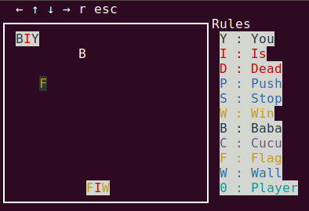
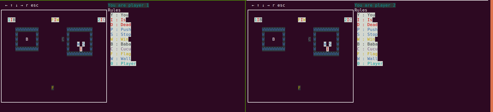

BABAISYOU
[](https://www.python.org/dev/peps/pep-0008/)
[](https://www.python.org/downloads/release/python-360/)
===

## Getting started

### Run the game

1) Clone the repo
```sh
git clone git@github.com:r4mbo7/babaisyou.git
```

2) Install requirements - you need python3 (venv is recommended)
```sh
pip install -r requirements.txt
```

3) **Game on !**
```
python3 -m babaisyou
```



### Maps

Maps are sample txt files. See examples in /maps directory.

**Change maps**
```
python3 -m babaisyou -m maps/3.txt
```

### Multiplayer mode

1) Start a redis
```sh
docker run --rm --name redis-server -p 6379:6379 -d redis
```

2) Start the server
```sh
python3 -m babaisyou -s
```

3) **Game on !**

player1
```sh
python3 -m babaisyou -c -m maps/mp0.txt
```

player2
```sh
python3 -m babaisyou -c -m maps/mp0.txt
```



## Dev

**Watch logs while playing**
```
watch -n 1 tail -n 25 app.log
```

**Prefixes to start a commit message**
```
DEV: development tool or utility
DOC: documentation
ENH: enhancement
MAINT: maintenance commit (refactoring, typos, etc)
TST: addition or modification of tests
```
